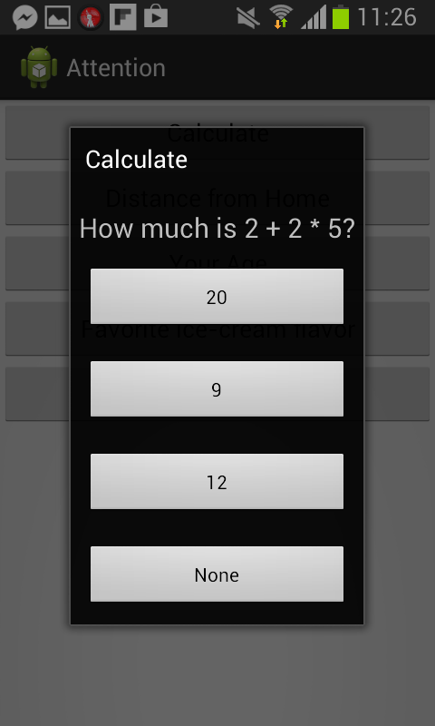
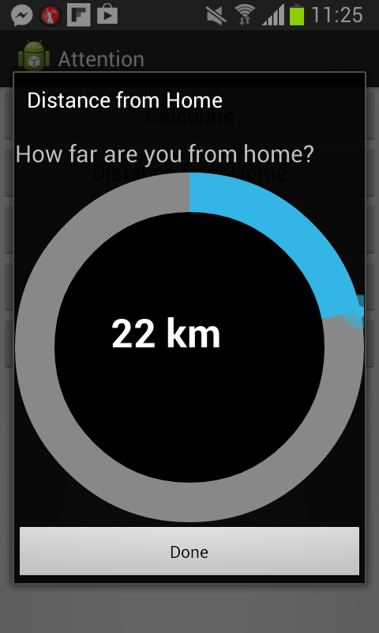
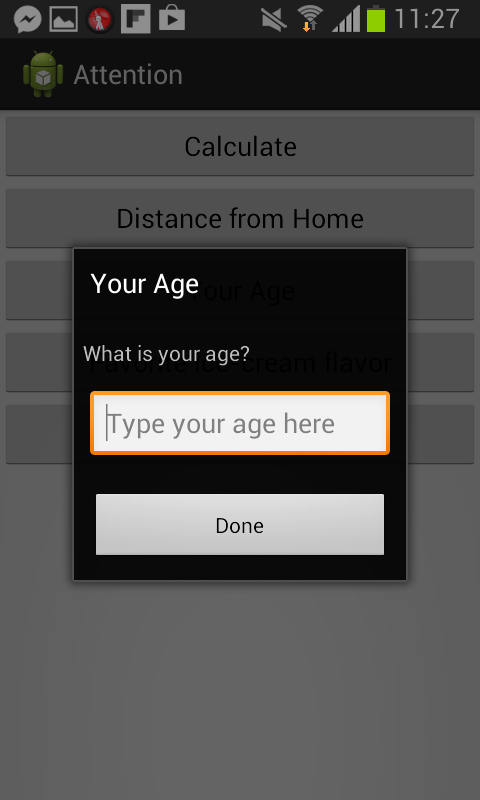
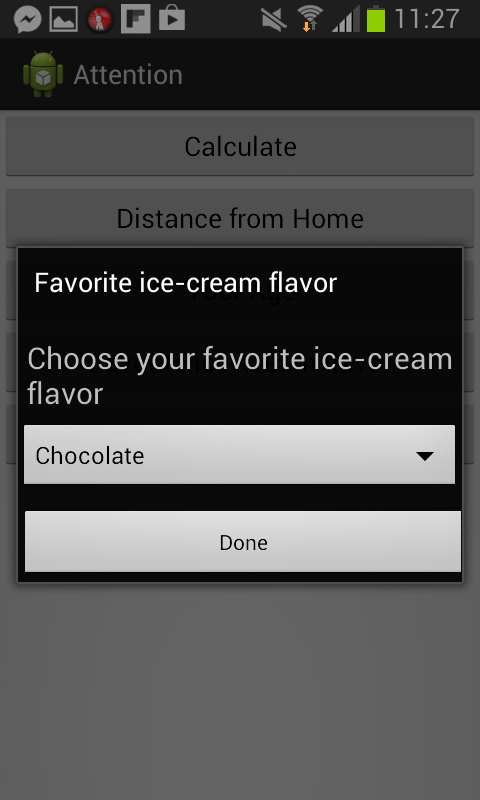
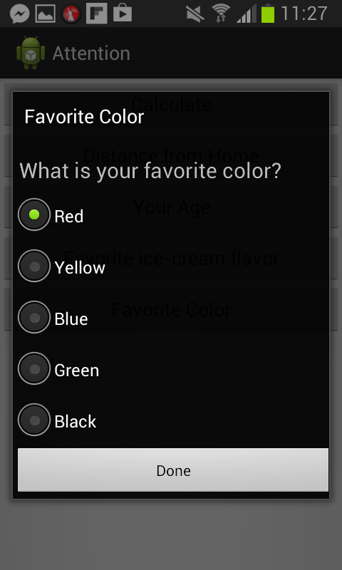

Attention
=========

Different Interfaces to test the attention in accordance with BCI device

###INTERFACE 1
===============
This Interface is use for measuring how the cognitive load varies when performing some intense applications like solving
a Mathematical question.

###INTERFACE 2
===============
This Interface is use for measuring how the cognitive load which varies dealing with a circular interface. The Original piece of code
was taken from <https://github.com/RaghavSood/AndroidCircularSeekBar.git> the repository of Raghav Sood. 

###INTERFACE 3
===============
This Interface is use for measuring how the cognitive load which varies dealing with insertion of data on mobile devices. 

###INTERFACE 4
===============
This Interface is use for measuring how the cognitive load varies dealing with drop down menu and then choosing an 
item from that menu.

###INTERFACE 5
===============
This Interface is use for measuring how the cognitive load varies dealing with a list and selecting an item by clicking on the 
radio button to confirm it. 

NOTE:
=====

This is a demo project that will be synced with the BCI device for understanding the cognitive load as descrived for each of the interfaces. 

